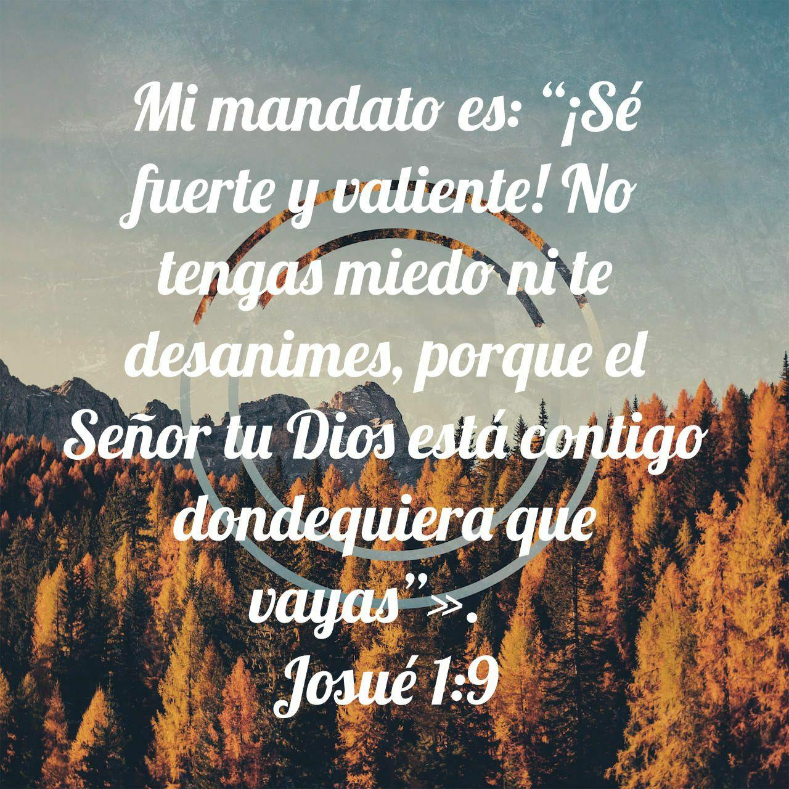
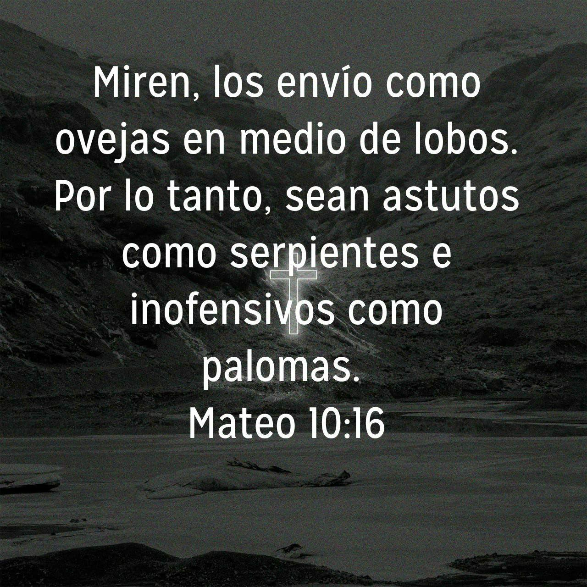

## ¡Bienvenida a una página dedicada solo a tu regalo!

Antes te dije, sentí que lo mails anteriores quedaban por debado de muchas de las pistas que se estuvieron enviando, así que quise compensarlo con un regalo un poco más original, jeje.

### Pista
Creo que toda esta página es una gran pista, y ya no voy a decir más. Espero que puedas adivinar, jeje.

### ¿Y el regalo? ¿Dónde está mi regalo?

Bueno che, paciencia, jajaja.

Pues, es que siento que más que un regalo es un reconocimiento, así quería decirte que hay algunas cosas que admiro de vos:

1. La capacidad (para mí) increíble de meter un carrerón en medicina a base de puro esfuerzo y dedicación. ¡Realmente te felicito y te insto a no bajar los brazos!

2. La pasión que tenés en todo lo relacionado a las misiones, cómo te involucrás, la investigación y esas ganas de compartirlo con todos, es muy bueno y me encanta. Por eso creo que el siguiente versículo viene bien, ya que nos insta a ir preparados sin perder la mansedumbre.

### Final
Muchas gracias, Estefi, por todos estos años de amistad. Quizás no seamos taaaan cercanos, pero igualmente sí hemos vivido muchas cosas durante mucho tiempo juntos. Te deseo un muy feliz día del amigo, y ojalá te haya gustado tu regalo. No sé si habrás adivinado antes, pero supongo que esto lo confirma ;p

¡Por muchos años más!

